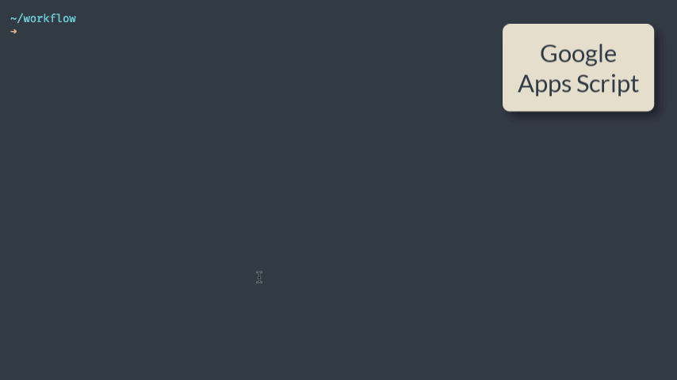
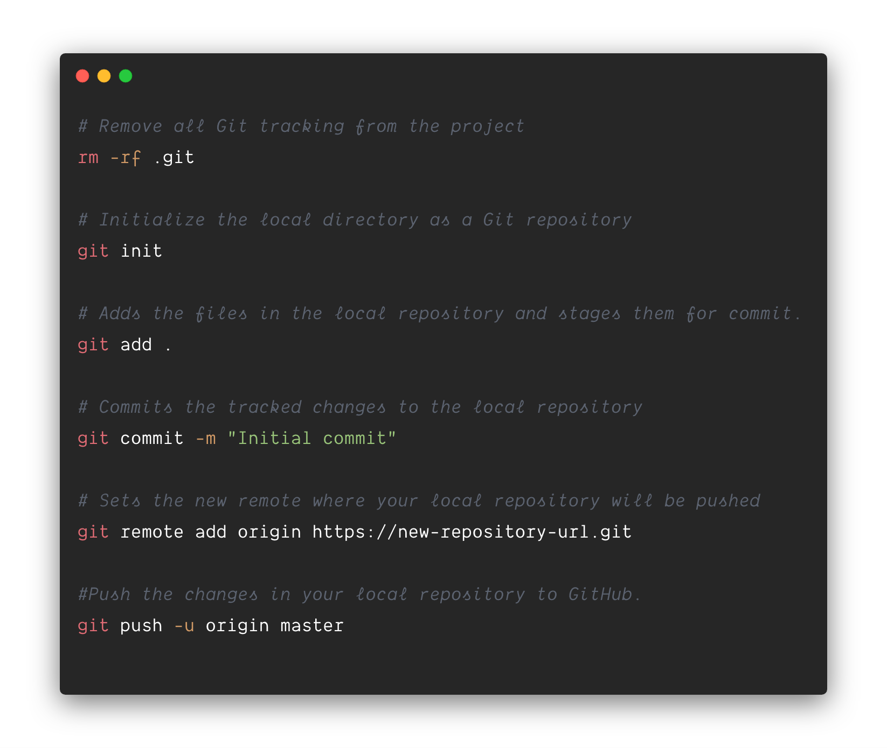

# Google Apps Script Development 💯

The Google Apps Script Starker kit supports the new **V8 JavaScript runtime** that powers Chrome and Node.js. You can write code using modern ECMAScript syntax like Arrow functions, Classes, Template Literals, Destructuring and more.


Please follow the 👉 **[step-by-step video tutorial](https://www.youtube.com/watch?v=KxdCIbeO4Uk)** 👈 for quickly getting started with Apps Script development inside Visual Studio Code.

You can build GSuite add-ons (for Google Docs, Slides, Gmail and Google Sheets), web applications and workflow automation routines with next-generation JavaScript.

The starter kit is used by [Digital Inspiration](https://digitalinspiration.com/) for building popular Google add-ons including [Gmail Mail Merge](https://gsuite.google.com/marketplace/app/mail_merge_with_attachments/223404411203), [Google Forms Notifications](https://gsuite.google.com/marketplace/app/email_notifications_for_google_forms/984866591130) and [Document Studio](https://gsuite.google.com/marketplace/app/document_studio/429444628321).

## Build with Google Apps Script 🚀

Setting up a modern development environment for building [Google Apps Script](https://www.labnol.org/topic/google-apps-script/) projects is easy and quick (**[video tutorial](https://www.youtube.com/watch?v=KxdCIbeO4Uk)**).

You also need to install Node.js which includes the npm package manager.

### :package: Getting Started

**1.** Clone the repository and install npm dependencies and [utilities](TOOLS.md).

```
git clone https://github.com/labnol/apps-script-starter my-project
cd my-project
npm install
```

Update: The `git clone` command adds a .git folder to your folder that pertains to the Apps Script Starter project and not your local project. You should either re-init the repository or use `degit` to clone the repository.

```
npx degit labnol/apps-script-starter my-project
```

**2.** Log in to Google clasp and authorize using your Google account.

```
npx clasp login
```

**3.** Create a new Google Script bound to a Google Sheet (or set the type as standalone to create a standalone script in your Google Drive)

```
npx clasp create --type sheets --title "My Apps Script Project" --rootDir ./dist
```

**4.** Include the necessary [OAuth Scopes](./scopes.md) in the [appsscript.json](./appsscript.json) file

**5.** Deploy the project

```
npm run deploy
```

The `dist` directory contains the bundled code that is pushed to Google Apps Script.



#### Enable JavaScript v8 Runtime

Inside the Google Apps Script editor, select View > Show project manifest to open the `appsscript.json` manifest file in the editor. Add a new `runtimeVersion` field and set the value to `V8`. Save your script.


### The .claspignore file

The `.claspignore` file allows you to specify file and directories that you do not wish to not upload to your Google Apps Script project via `clasp push`.

The default `.claspignore` file in the Apps Script Starter kit will push all the JS and HTML inside the `rootDir` folder and ignore all the other files.

## :beginner: Using Git with Google Apps Script



Create a new repository in Github and make a note of the URL of the new repository. Next, open the terminal and run the above commands to push your Apps Script project to Github.

## Custom Google Sheet function

Please read [the tutorial](./FUNCTIONS.md) on how to write custom functions for Google Sheets using Apps Script.

## Testing your code
You can run tests with jest using
```
npm run test
```
This has limitations:

* You _can_ test code that has no dependencies to Google App Script code, e.g.
```
const hasCpuTime = () => !(Date.now() - START_TIME > ONE_MINUTE * 4);

```
* You _can not_ test code that has dependencies to Google App Script code, e.g.
```
function notTestable() {
    Logger.log("notTestable"); // <-- Google Apps Script function. Not callable in dev
    SpreadsheetApp.getUi(); // <-- Google Apps Script function. Not callable in dev
    ...
}
```
Check out [jest 'expects' here](https://jestjs.io/docs/expect)

## :fire: Meet the Developer


[Amit Agarwal](https://www.labnol.org/about) is a web geek, Google Developers Expert (GSuite, Google Apps Script) and author of [labnol.org](https://www.labnol.org/), a popular tech how-to website.

He frequently uses [Google Apps Script](https://ctrlq.org/) to automate workflows and enhance productivity. Reach him on [Twitter](https://twitter.com/labnol) or email `amit@labnol.org`

### :cherry_blossom: Contribution

Contributions and feature requests are welcome. If you are using the Google Apps Script starter package and fixed a bug for yourself, please consider submitting a PR!

### :lock: License

[MIT License](https://github.com/labnol/apps-script-starter/blob/master/LICENSE) (c) [Amit Agarwal](https://www.labnol.org/about/)
